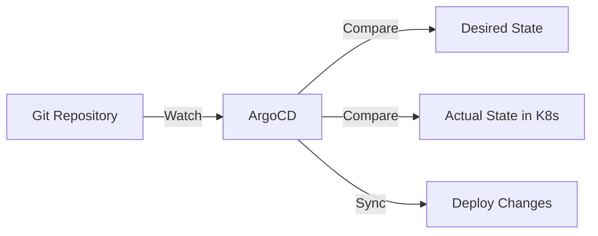

# ArgoCD

## Overview

**ArgoCD** is our GitOps continuous delivery tool. It automatically synchronizes applications from our Git repository to Kubernetes.

## How It Works



## Application Structure

Each service has an ArgoCD Application definition:

```yaml
apiVersion: argoproj.io/v1alpha1
kind: Application
metadata:
  name: example-service
  namespace: argocd
spec:
  project: default
  source:
    repoURL: https://gitea0213.kro.kr/bluemayne/infrastructure.git
    targetRevision: main
    path: example-service
  destination:
    server: https://kubernetes.default.svc
    namespace: example-service
  syncPolicy:
    automated:
      prune: true
      selfHeal: true
```

## Key Features

### Automated Sync

- **prune: true**: Removes resources deleted from Git
- **selfHeal: true**: Reverts manual changes to match Git
- **allowEmpty: false**: Prevents accidental empty deployments

### Manual Operations

```bash
# List applications
sudo kubectl get applications -n argocd

# View application status
sudo kubectl get application -n argocd <app-name> -o yaml

# Force refresh
argocd app get <app-name> --refresh
```

## Deployment Workflow

### 1. Make Changes

Edit files in the infrastructure repository:

```bash
cd /path/to/infrastructure
vim example-service/deployment.yaml
git add .
git commit -m "update deployment"
git push
```

### 2. ArgoCD Detects Changes

- Polls Git repository every 3 minutes
- Or immediately via webhook (if configured)

### 3. Automatic Sync

- Compares desired state (Git) vs actual state (K8s)
- Applies changes automatically
- Reports status

### 4. Monitor Deployment

```bash
# Check application sync status
sudo kubectl get applications -n argocd

# Watch pod rollout
sudo kubectl rollout status deployment/<name> -n <namespace>
```

## Common Patterns

### Adding a New Service

1. Create service directory: `infrastructure/my-service/`
2. Add Kubernetes manifests
3. Create kustomization.yaml
4. Add ArgoCD Application: `infrastructure/my-service/argocd/my-service.yaml`
5. Reference in main kustomization.yaml
6. Git push → ArgoCD deploys automatically

### Updating a Service

1. Edit deployment.yaml or other files
2. Git commit & push
3. Wait for ArgoCD sync (or force refresh)
4. Verify deployment

### Rolling Back

```bash
# Method 1: Git revert
git revert <commit-hash>
git push

# Method 2: Sync to specific commit
argocd app sync <app-name> --revision <commit-hash>
```

## Troubleshooting

### Sync Stuck

```bash
# Force hard refresh
sudo kubectl patch application -n argocd <app-name> \
  -p '{"metadata": {"annotations": {"argocd.argoproj.io/refresh": "hard"}}}' \
  --type merge
```

### Out of Sync

Check what's different:

```bash
argocd app diff <app-name>
```

### Sync Failed

View detailed error:

```bash
sudo kubectl describe application -n argocd <app-name>
```

## Best Practices

1. **Always use Git**: Don't make manual kubectl changes
2. **Small commits**: Easier to review and rollback
3. **Test locally**: Use `kubectl apply --dry-run=client`
4. **Use pruning**: Keep cluster clean with `prune: true`
5. **Enable selfHeal**: Prevent configuration drift

## Next Steps

- [Monitoring with Prometheus](./monitoring)
- [Kubernetes Operations](./kubernetes)
