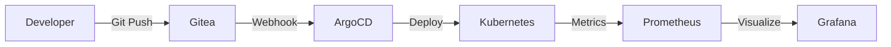

# Architecture

## System Architecture

Our infrastructure follows modern DevOps practices with GitOps at its core.

### GitOps Workflow



### Network Architecture

#### Ingress Layer
- **nginx-ingress-controller**: Routes external traffic
- **cert-manager**: Manages SSL certificates via Let's Encrypt
- **DNS**: kro.kr domain with wildcard support

#### Application Layer
- Each service runs in its own namespace
- Resource limits and requests defined
- Health checks and readiness probes

#### Data Layer
- **PostgreSQL**: Primary database for Gitea, Grafana
- **Persistent Volumes**: Using local-path provisioner
- **Backup**: Automated backups to S3-compatible storage (MinIO)

### Security Architecture

```yaml
Security Layers:
  1. Network Level:
     - Ingress with TLS termination
     - Network policies between namespaces

  2. Application Level:
     - External Secrets for sensitive data
     - HashiCorp Vault integration
     - Secret rotation policies

  3. Access Control:
     - RBAC for Kubernetes
     - SSO integration (future)
     - Audit logging
```

## Design Principles

### 1. Everything as Code
- Infrastructure: Kubernetes YAML
- Configuration: Kustomize
- Secrets: External Secrets Operator
- Monitoring: Prometheus rules as code

### 2. GitOps First
- Single source of truth: Git repository
- Automatic synchronization via ArgoCD
- Rollback capability through Git history

### 3. Observability
- Metrics: Prometheus
- Logs: Loki
- Traces: (Future: Jaeger/Tempo)
- Dashboards: Grafana

### 4. High Availability
- Multi-node Kubernetes cluster
- Replicated stateful services
- Automated failover

## Technology Stack

| Layer | Technology |
|-------|-----------|
| Container Orchestration | Kubernetes (K3s) |
| GitOps | ArgoCD |
| Service Mesh | (Future: Istio/Linkerd) |
| Ingress | nginx-ingress |
| Certificate Management | cert-manager |
| Secrets Management | External Secrets + Vault |
| Monitoring | Prometheus + Grafana |
| Logging | Loki + Promtail |
| Storage | local-path, MinIO |
| Database | PostgreSQL |
| Git | Gitea |
| Documentation | Docusaurus |

## Further Reading

- [Kubernetes Setup Details](../services/kubernetes)
- [ArgoCD Configuration](../services/argocd)
- [Monitoring Stack](../services/monitoring)
